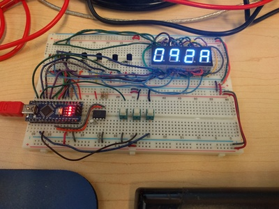

# HexClock

This is a somewhat silly project to make a digital clock that displays the current time (hour and minute) in hexadecimal.

Here is a picture of the prototype (click to embiggen):

The [KiCad](http://kicad-pcb.org/) hardware schematic is in the [hw](hw) directory.  The required parts are:

* Arduino Nano
* DS1307 i2c real time clock chip
* 4 common anode 7 segment displays
* 4 2N3906 PNP transistors (to switch common anode voltages for LED displays)
* 4 4.7k Ohm resistors (to drive gates of the PNP transistors)
* 2 1K pull-up resistors for i2c SDA and SCL lines
* 7 current limiting resistors for segment cathodes (I used 220 Ohm)
* 3 normally open pushbutton switches
* 3V lithium cell (CR2032 or similar) for backup of RTC
* 5V power supply of some kind

The software is in the [HexClock](HexClock) directory.  It requires the [RTCLib](https://github.com/adafruit/RTClib) and [Bounce2](https://github.com/thomasfredericks/Bounce2) libraries, both of which you can install using the Arduino package manager.
